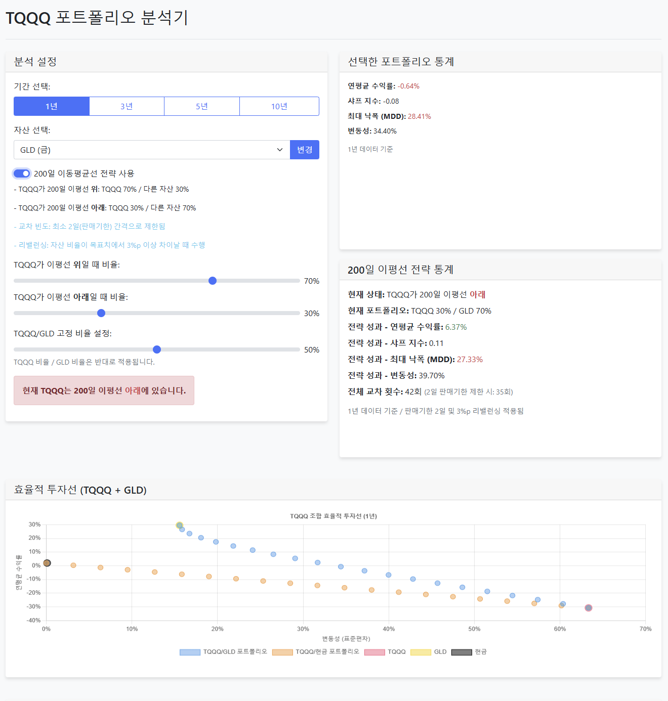
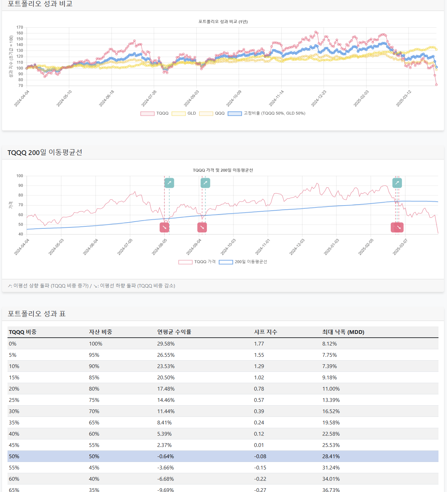

# TQQQ 포트폴리오 분석 도구

TQQQ와 다양한 자산을 조합한 포트폴리오의 성과를 분석하는 웹입니다.




## 개발 목적

적절한 포트폴리오란 무엇인지에 대한 궁금증에서 시작된 프로젝트입니다.

## 기능

### 1. 효율적 투자선 시각화
- TQQQ와 선택 자산(GLD, SHY, TLT, SCHD, VNQ)의 위험-수익률 차트
- 변동성 대비 수익률 분석

### 2. 200일 이동평균선 전략
- 이동평균선 위/아래 상황에 따른 자산 배분 비율 변경
- 주 1회 제한으로 과도한 거래 방지

### 3. 포트폴리오 성과 분석
- 연평균 수익률, 샤프 지수, 최대 낙폭(MDD), 변동성 계산
- 1년, 3년, 5년, 10년 기간별 분석

### 4. 실시간 차트
- TQQQ 가격과 200일 이동평균선 표시
- 교차점 및 현재 위치 확인

## 설치 및 실행

```bash
git clone https://github.com/lee-daon/project_archive.git
cd 'toy_project\tqqq\code'
npm install
npm start
```

브라우저에서 `http://localhost:3000` 접속
