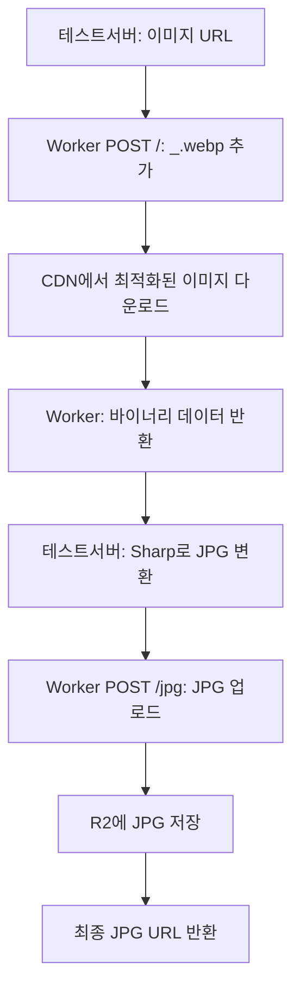

# Image Downloader & Converter System

Cloudflare Workers + 멀티스레드 Node.js를 결합한 완전한 이미지 처리 시스템입니다.

## 시스템 구성

### 🔧 **Cloudflare Worker (src/index.js)**
- ✅ **POST /** : `_.webp` 추가하여 이미지 다운로드, 바이너리 반환
- ✅ **POST /jpg** : JPG 바이너리를 R2에 저장, URL 반환  
- ✅ IP 분산을 위한 프록시 역할
- ✅ 시크릿 키 인증

### 🚀 **멀티스레드 프로세서 (testServer.js)**
- ✅ Worker에서 이미지 바이너리 받기
- ✅ Sharp로 모든 이미지 → JPG 변환
- ✅ 변환된 JPG를 Worker로 업로드
- ✅ 4개 워커 스레드 동시 처리

## 설정

### 1. 의존성 설치
```bash
npm install
# 이미지 변환을 위한 sharp 라이브러리 포함
```

### 2. Cloudflare 설정
1. [Cloudflare 대시보드](https://dash.cloudflare.com/)에서 R2 버킷 생성
2. R2 custom domain 설정

### 3. 환경 설정
`wrangler.toml`에서 버킷명과 도메인 수정:
```toml
[[r2_buckets]]
binding = "R2_BUCKET"
bucket_name = "your-actual-bucket-name"

[vars]
R2_PUBLIC_URL = "https://your-r2-domain.com"
```

### 4. 시크릿 키 설정
```bash
npx wrangler secret put AUTH_KEY_SECRET
```

### 5. 배포
```bash
# 개발
npm run dev

# 배포
npm run deploy
```

## 사용법

### 1. **멀티스레드 일괄 처리**
```bash
# 모든 테스트 이미지 처리 (4개 동시)
node testServer.js

# 실제 결과:
🎯 총 10개 이미지 처리 시작 (최대 4개 동시 처리)
🚀 워커 시작 (1/4): https://img.alicdn.com/...
📥 이미지 다운로드 요청: https://img.alicdn.com/...
📁 이미지 다운로드 완료: image/webp, 245760 bytes
🔄 JPG 변환 중...
✅ JPG 변환 완료: 189432 bytes
📤 JPG 업로드 중...
🎉 JPG 업로드 완료: 2024/01/15/image_1703123456_abc123.jpg
✅ 워커 완료 (0/4)
```

### 2. **단일 이미지 처리**
```bash
node testServer.js "https://img.alicdn.com/example.jpg"
```

### 3. **Worker 직접 호출**
```bash
# 이미지 다운로드 (바이너리 반환)
curl -X POST https://your-worker.workers.dev/ \
  -H "Content-Type: application/json" \
  -H "X-Auth-Key: your-secret-key" \
  -d '{"url": "https://example.com/image.jpg"}' \
  --output downloaded.webp

# JPG 업로드 (URL 반환)  
curl -X POST https://your-worker.workers.dev/jpg \
  -H "Content-Type: image/jpeg" \
  -H "X-Auth-Key: your-secret-key" \
  --data-binary @converted.jpg
```

## 작업 흐름



## R2 저장 구조
```
/2024/01/15/image_1234567890_abc123.jpg  ← 최종 JPG만 저장
/2024/01/15/image_1234567891_def456.jpg
```

## 성능 최적화

- **IP 분산**: Worker를 프록시로 사용
- **멀티스레딩**: 4개 동시 처리
- **WebP 우선**: `_.webp`로 최적화된 버전 요청
- **스마트 fallback**: WebP 실패시 원본 사용

## 지원 포맷

**입력**: WebP, JPEG, PNG, BMP  
**출력**: JPEG (메인서버 호환성) 