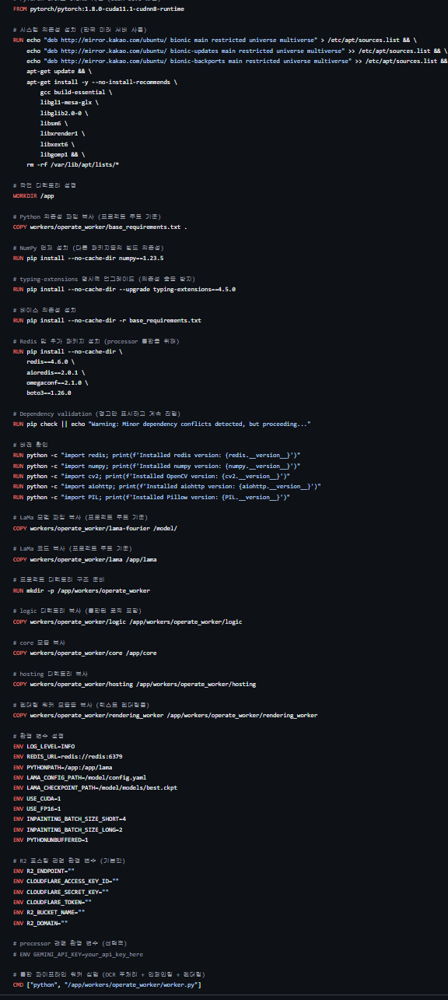

v2->v3는 기능의 향상 보다는 속도의 개선과, 복잡함을 줄여서 유지보수의 향상에 초점을 맞추었습니다.

---

#### 1. 워크플로우를 큰 4개의 파이프라인으로 분리, 파이프라인별 내부 최적화

-   **기존 (V2) 방식**
    여러 파편화된 모듈을 메인 워커가 일일히 cpu바운드/io바운드/gpu바운드를 고려하여 작업을 분배하는 과정이였습니다다

-   **개선 (V3) 방식**
    V3는 4개의 핵심 파이프라인으로 분리하고, 메인 워커가 일을 제공하면 메인워커가 내부적으로 cpu/io/gpu바운드를 구분하여 병렬처리 및 비동기, 배치처리를 하도록 캡슐화 하였습니다. **중간 과정에서의 모든 복잡성이 사라져**, 워커의 코드는 900줄에서 300줄로 줄었고, 응집도가 높아지고 각각의 모듈의 인풋과 아웃풋이 명확하게 되어 추후 리펙토링이 쉬워졌습니다. 또한 엵혀있던 여러 로직이 모두 각 파이프라인의 메인 함수 내부로 들어가 결합도를 낮출 수 있었습니다. 

#### 2. 속도 최적화

-   **기존 (V2) 방식**
    데이터 크기에 따라 두가지 큐로 나누어서 두가지 크기의 이미지만 처리 가능했고 처리가 느렸습니다.

-   **개선 (V3) 방식**
    기존 lama-inpainting모델과 업스케일링 모델을 .onnx로 변환하는 과정에서 내부 연산 일부를 개선해 배치처리가 가능하도록 수정하였습니다. 리사이즈는 정수배(1,2,3,4,5...)로만 하여 인페인팅 모델이 구조를 정확히 파악 가능하도록 하였고, 디노이즈를 도입해 .jpg, .webp등의 노이즈로 인한 문제를 개선했습니다. 마지막으로 동적 높이/넓이 대신 고정된 512px을 받아 gpu연산량과 연산시간을 약 5~6배 정도 줄였고 업스케일링을 통해 화질도 챙기고자 하였습니다.

#### 3. 의존성 문제 해결 

-   **기존 (V2) 방식**
    cuda 11.1을 바탕으로 여러 과거버전의 라이브러리와 새로 필요한 라이브러리 간의 의존성 충돌이 심하여서, 도커에 여러 기능을 모듈처럼 만들었습니다. 

-   **개선 (V3) 방식**
    V3에서는 모든 AI 모델을 가볍고 빠른 실행 전용 포맷인 **`ONNX`로 통일**했습니다. cuda 12.x버전을 바탕으로 최신 라이브러리 및 라이브러리 버전 선택의 폭이 넓어져 파편화된 각 모듈을 하나의 도커 내부로 통일하였고, 이과정에서 shm공유메모리 대신 내부 메모리, redis대신 배열을 통해 네트워크 오버헤드랑 불필요한 연산을 줄였습니다.

    
    
    
    

