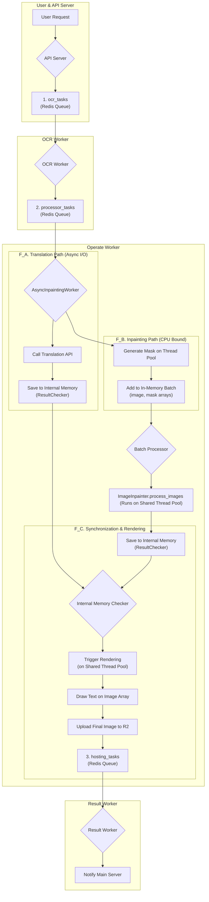

# Operator Worker Logic Flow

이 문서는 `operate_worker`의 내부 데이터 흐름과 로직을 설명합니다. 워커는 Redis 큐에서 OCR 완료 작업을 받아, 인페인팅과 번역을 병렬로 처리한 후, 최종 이미지를 렌더링하고 다음 큐로 전달하는 효율적인 파이프라인 구조를 가집니다.

## 데이터 흐름 다이어그램 (Mermaid)

## 단계별 상세 설명

1.  **작업 수신 (`processor_tasks` 큐)**
    *   `operate_worker`는 Redis의 `processor_tasks` 큐를 리스닝하여 OCR이 완료된 작업을 받습니다.
    *   데이터에는 `request_id`, `image_url`, `ocr_result` 등이 포함됩니다.

2.  **병렬 처리 시작**
    *   하나의 작업이 들어오면, **번역**과 **인페인팅 준비** 두 경로로 나뉘어 동시에 처리됩니다.

3.  **A. 번역 경로 (I/O-Bound)**
    *   **번역 API 호출**: `logic.text_translate` 모듈이 `ocr_result`의 텍스트를 모아 외부 번역 API(Gemini)를 비동기적으로 호출합니다.
    *   **결과 저장**: 번역이 완료되면, 결과 데이터는 `ResultChecker`의 내부 메모리(`translation_results`)에 저장됩니다.

4.  **B. 인페인팅 준비 경로 (CPU-Bound)**
    *   **마스크 생성**: `generate_mask_pure_sync` 함수가 **공유 스레드 풀**에서 실행되어, OCR 좌표를 기반으로 인페인팅에 사용할 마스크(Numpy 배열)를 생성합니다.
    *   **배치 추가**: 원본 이미지와 생성된 마스크 배열은 `AsyncInpaintingWorker`의 `task_batch` 리스트에 직접 추가되어 다음 처리를 기다립니다.

5.  **통합 인페인팅 처리**
    *   **배치 실행**: `_inpainting_batch_processor` 워커가 주기적으로 또는 배치가 가득 찼을 때, `ImageInpainter.process_images`를 호출합니다.
    *   **통합 파이프라인**: `ImageInpainter`는 전달받은 이미지와 마스크 배치에 대해 전처리, ONNX 추론, 후처리까지의 모든 과정을 **공유 스레드 풀**을 활용하여 효율적으로 수행합니다.
    *   **결과 저장**: 처리된 인페인팅 이미지(Numpy 배열)는 `ResultChecker`의 내부 메모리(`inpainting_results`)에 저장됩니다.

6.  **동기화 및 최종 렌더링**
    *   **결과 확인**: `ResultChecker`는 특정 `request_id`에 대해 번역과 인페인팅 결과가 모두 내부 메모리에 저장되는 시점을 감지합니다.
    *   **렌더링 트리거**: 두 결과가 모두 준비되면, `RenderingProcessor`가 **공유 스레드 풀**에서 최종 렌더링 작업을 실행합니다.
    *   **최종 이미지 생성**: 인페인팅된 이미지 배열 위에 번역된 텍스트를 직접 그려 최종 이미지를 완성합니다.
    *   **업로드 및 전달**: 완성된 이미지는 R2 스토리지에 업로드되고, 이 이미지의 URL이 `hosting_tasks` Redis 큐에 추가되어 `Result Worker`에게 전달됩니다.

## 주요 개선 사항

*   **인메모리 데이터 처리**: 더 이상 공유 메모리(SHM), 임시 파일, Redis Hash 등 중간 저장소를 사용하지 않습니다. 모든 이미지 데이터는 Numpy 배열 형태로 메모리 내에서 직접 전달되어 I/O 병목을 제거하고 성능을 극대화했습니다.
*   **통합 파이프라인**: `ImageInpainter` 모듈이 전처리-추론-후처리 과정을 모두 담당하여 코드 구조가 단순해지고 응집도가 높아졌습니다.
*   **자원 공유**: 워커 내 모든 CPU 집약적 작업(마스크 생성, 인페인팅, 렌더링)이 단일 `ThreadPoolExecutor`를 공유하여 리소스 사용이 효율적입니다.
