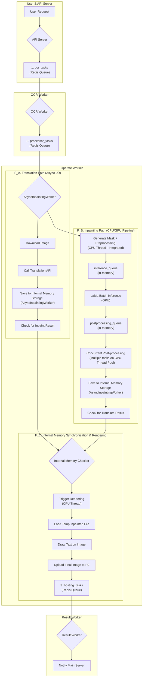

# Operator Worker Logic Flow

이 문서는 `operate_worker`의 내부 데이터 흐름과 로직을 설명합니다. 워커는 Redis 큐에서 OCR 완료 작업을 받아, 인페인팅과 번역을 병렬로 처리한 후, 최종 이미지를 렌더링하고 다음 큐로 전달하는 복합적인 파이프라인 구조를 가집니다.

## 데이터 흐름 다이어그램 (Mermaid)

## 단계별 상세 설명

1.  **작업 수신 (`processor_tasks` 큐)**
    *   `operate_worker`는 Redis의 `processor_tasks` 리스트 큐를 `BLPOP`으로 리스닝합니다.
    *   수신 데이터에는 `request_id`, 원본 이미지 `image_url`, `image_id`, `ocr_result`가 포함됩니다.

2.  **병렬 처리 시작**
    *   하나의 작업이 들어오면, **번역**과 **인페인팅** 두 개의 경로로 나뉘어 비동기적으로 동시에 처리됩니다.

3.  **A. 번역 경로 (I/O Bound)**
    *   **이미지 다운로드**: `image_url`을 사용해 원본 이미지를 비동기적으로 다운로드합니다. (렌더링 시 색상 분석에 필요)
    *   **중국어 필터링**: `ocr_result`에서 중국어가 포함된 텍스트만 추출합니다.
    *   **번역 API 호출**: 필터링된 텍스트들을 모아 Gemini API를 비동기적으로 호출하여 한 번에 번역합니다.
    *   **결과 저장**: 번역이 완료되면, 번역 결과(`translate_result`)와 원본 이미지 URL(`original_image_url`)을 워커의 **내부 메모리 저장소**에 저장합니다.
    *   **결과 확인**: 워커 내부에서 인페인팅 결과가 이미 저장되어 있는지 확인하고, 있다면 즉시 렌더링을 트리거합니다.

4.  **B. 인페인팅 경로 (CPU/GPU Bound Pipeline)**
    *   **마스크 생성 + 전처리 통합**: `ocr_result`의 좌표를 이용해 텍스트 영역을 가리는 마스크(mask)를 생성하고, 바로 이어서 bilateral filter 디노이징, 리사이즈, 패딩 등의 전처리 작업을 **한 번에** 수행합니다. 이 통합된 작업은 CPU 집약적이므로 별도 스레드 풀에서 실행됩니다. 원본 이미지와 마스크, 그리고 전처리된 이미지와 마스크는 **공유 메모리(SHM)**에 저장되어 프로세스 내에서 효율적으로 전달됩니다.
    *   **추론**: `inference_queue` (메모리 큐)를 통해 GPU 추론 단계로 전달됩니다.
        *   GPU 세마포어로 동시 접근을 제어하며, 여러 작업을 배치(batch)로 묶어 LaMa 모델로 인페인팅을 수행합니다.
    *   **후처리**: `postprocessing_queue` (메모리 큐)를 통해 후처리 단계로 전달됩니다.
        *   '매니저' 워커가 '핸들러' 태스크를 병렬로 생성합니다.
        *   각 핸들러는 **CPU 스레드 풀**을 사용하여 추론 결과를 원본 이미지 크기로 **동시에 여러 개** 복원합니다.
    *   **결과 저장**: 후처리가 완료된 인페인팅 이미지(numpy 배열)는 **/app/output/temp\_inpainted** 경로에 임시 파일로 저장됩니다. 이 파일 경로와 `image_id`, `is_long` 정보가 워커의 **내부 메모리 저장소**에 저장됩니다.
    *   **결과 확인**: 워커 내부에서 번역 결과가 이미 저장되어 있는지 확인하고, 있다면 즉시 렌더링을 트리거합니다.

5.  **내부 메모리 동기화 및 렌더링**
    *   워ker의 **내부 메모리 저장소**가 두 경로의 결과가 모두 저장되는 시점을 감지합니다.
    *   두 결과가 모두 준비되면, `_trigger_rendering_internal` 함수가 호출됩니다.
    *   이 함수는 임시 저장된 인페인팅 이미지를 파일에서 읽고, 내부 저장소에서 번역 데이터를 가져와 `RenderingProcessor`에 전달합니다.
    *   **렌더링**: CPU 스레드 풀에서 다음 작업이 수행됩니다.
        1.  인페인팅된 이미지 위에 번역된 텍스트의 적절한 색상과 크기를 계산합니다.
        2.  계산된 스타일로 텍스트를 이미지에 그립니다.
        3.  완성된 최종 이미지를 R2 스토리지에 업로드합니다.
    *   **다음 큐로 전달**: R2 업로드 후 받은 최종 이미지 URL을 `hosting_tasks` 큐에 넣어 `Result Worker`에게 전달합니다.

6.  **사용된 리소스 정리**
    *   파이프라인 각 단계에서 사용된 공유 메모리(SHM)와 임시 파일은 렌더링 작업 제출 후 적절한 시점에 삭제되어 메모리 및 디스크 누수를 방지합니다.
    *   **성능 최적화**: 전처리 큐 제거로 마스크 생성과 전처리가 통합되어 레이턴시가 감소하고, 워커 수가 줄어들어 리소스 사용량이 최적화되었습니다.
